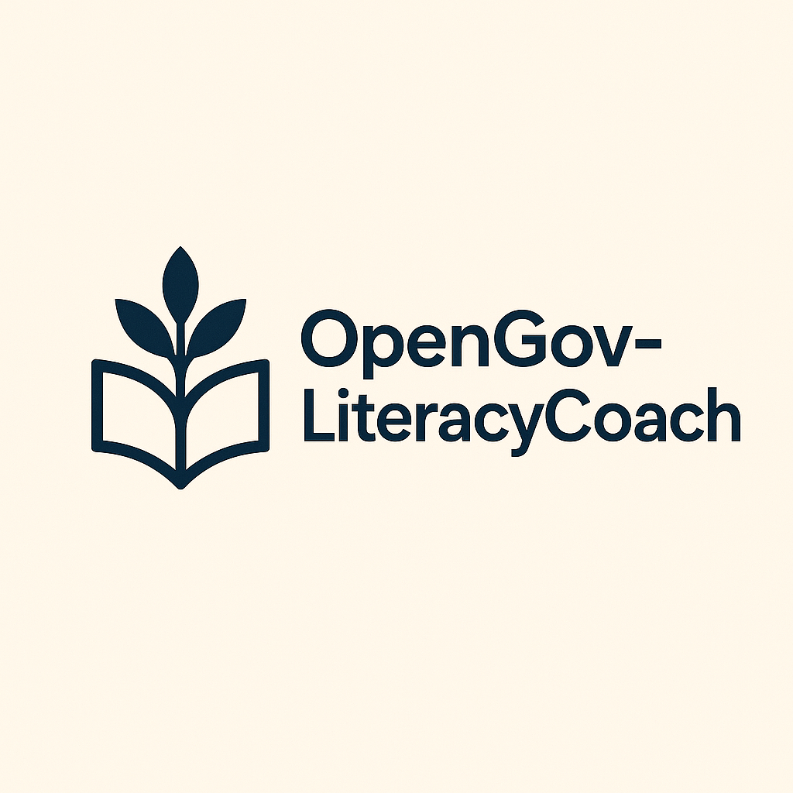

<p align="center">
  
</p>

# OpenGov-Literacy Coach

Voice-first AI literacy platform that combines speech-driven tutoring, rubric-aligned writing feedback, leveled text search, and teacher-facing analytics. The system is organized as a set of FastAPI microservices orchestrated through Docker Compose, with OpenAI SDK integrations for speech-to-text, text-to-speech, chat orchestration, and embeddings.

## Highlights

- Voice coaching loop: record audio, transcribe with Whisper, tutor via OpenAI Agents tool-calling, respond with synthesized speech.
- Reading assessment: compute words-correct-per-minute (WCPM), accuracy, and error highlights; results routed to the teacher dashboard.
- Writing feedback: rubric scoring pipeline with JSON validation; writing scores and feedback logged for teacher review.
- Content service: leveled text catalog with metadata filters and retrieval augmented generation (RAG) search.
- Teacher service: rosters, assignments, CSV import, and analytics surface aggregated results.
- Comprehensive test suite and Docker-first deployment workflow.

## Service Topology

| Service   | Port | Description |
|-----------|------|-------------|
| gateway   | 8000 | Web UI, voice turn handling, writing score proxy, teacher logging |
| agent     | 8001 | OpenAI chat orchestrator with tool-calling |
| content   | 8002 | Text catalog, ingestion, metadata search, RAG |
| assessment| 8003 | Reading fluency metrics and writing rubric scorer |
| teacher   | 8004 | Rosters, assignments, results analytics |

## Requirements

- Docker and Docker Compose
- Python 3.11+ (for local development)
- OpenAI API key exported as environment variable `OPENAI_API_KEY`

Optional overrides with defaults:

| Variable | Default |
| --- | --- |
| `LITCOACH_AGENT_MODEL` | `gpt-4o-mini` |
| `LITCOACH_EMBED_MODEL` | `text-embedding-3-small` |
| `LITCOACH_TTS_MODEL` | `tts-1` |
| `LITCOACH_TRANSCRIBE_MODEL` | `whisper-1` |
| `CONTENT_DB_PATH` | `/data/content.db` |
| `CONTENT_TEXTS_JSON` | `/app/data/texts/texts.json` |
| `AGENT_URL` | `http://agent:8001` |
| `ASSESSMENT_URL` | `http://assessment:8003` |
| `TEACHER_URL` | `http://teacher:8004` |
| `GATEWAY_HOST` | `0.0.0.0` |
| `GATEWAY_PORT` | `8000` |

## Quickstart (Docker)

1. Export your OpenAI API key:
   ```bash
   export OPENAI_API_KEY="sk-your-key"
   ```
2. Launch the full stack:
   ```bash
   docker compose up --build
   ```
3. Open the web app:
   - Gateway: http://localhost:8000
   - Reader: http://localhost:8000/reader.html
   - Writer: http://localhost:8000/writer.html
   - Teacher Dashboard: http://localhost:8000/teacher.html

Quickstart (Mock Compose)

Run only the gateway in offline mock mode:

```bash
docker compose -f docker-compose.mock.yml up --build
```

## Local Development

Install [uv](https://docs.astral.sh/uv/) for fast environments, then run individual services:

```bash
uv run -m uvicorn litcoach.services.content.app:app --reload --port 8002
uv run -m uvicorn litcoach.services.assessment.app:app --reload --port 8003
uv run -m uvicorn litcoach.services.teacher_api.app:app --reload --port 8004
uv run -m uvicorn litcoach.services.agent.app:app --reload --port 8001
uv run -m uvicorn litcoach.services.gateway.app:app --reload --port 8000
```

To ingest texts without starting the API, run:


## Mock Mode (Offline)

You can run the gateway alone with no real API keys or other services by enabling mock mode. This returns deterministic stubbed responses for transcription, TTS, chat, assessment, and writing score.

- Copy `.env.example` to `.env` and optionally set `LITCOACH_MOCK_*` values.
- Export `LITCOACH_MOCK=true` (or set it in `.env`).
- Start the gateway only:

```bash
export LITCOACH_MOCK=true
export GATEWAY_HOST=0.0.0.0
export GATEWAY_PORT=8000
python -m uvicorn litcoach.services.gateway.app:app --port ${GATEWAY_PORT}
```

Open http://localhost:8000 and try Reader/Writer flows. The app will:
- Return a mock transcript and assistant reply.
- Synthesize mock audio bytes.
- Short‑circuit assessment and writing score with stubbed results.
```bash
uv run python -m litcoach.services.content.ingest
```

## Testing

Execute the full suite:

```bash
tox
```

or:

```bash
uv run -m pytest -q
```

## Command-Line Interface

-   Install the project in editable mode (or run via `uv run`) and use the CLI entrypoint `litcoach-cli`.
-   Commands:
    -   `litcoach-cli health` – health check across gateway, agent, content, assessment, teacher services.
    -   `litcoach-cli tutor --prompt "How do I summarize this chapter?" --grade 5` – run a sample tutoring exchange.
    -   `litcoach-cli classes --name "Period 1"` – create a class and list all classes via the Teacher API.
    -   `litcoach-cli doctor` – run full diagnostics.
-   Environment variables: `GATEWAY_URL`, `AGENT_URL`, `CONTENT_URL`, `ASSESSMENT_URL`, `TEACHER_URL` (default to localhost ports).

## Teacher Dashboard Workflow

1. Create a class and import a roster CSV (`student_id,student_name`).
2. Configure reading or writing assignments.
3. Students complete reading turns or writing submissions.
4. Gateway logs assessment results to the teacher API, and analytics aggregate class-level progress.

## Caching Strategy

- Embeddings and TTS responses cache under `data/runtime` keyed by request hash.
- Clear the directory to force recomputation.

## Data Inputs

- `data/texts/texts.json`: leveled reading passages with metadata.
- `data/evals/*.jsonl`: sample evaluation datasets for assessment service verification.

## Testing and CI

- Local tests with coverage:

```bash
pip install -r requirements-test.txt
pip install -e .
PYTEST_DISABLE_PLUGIN_AUTOLOAD=1 pytest -p pytest_cov
```

- GitHub Actions:
  - `.github/workflows/ci.yml` runs tests on pushes and PRs (Python 3.11).
  - `.github/workflows/release.yml` runs on tags `v*.*.*`, tests, builds, and publishes if secrets are present.

## Releasing

- Tag a version (e.g., `v1.1.0`) and push the tag to trigger the release workflow.
- Configure repository secrets:
  - `PYPI_API_TOKEN` for publishing to PyPI.
  - Optional Docker Hub: `DOCKERHUB_USERNAME`, `DOCKERHUB_TOKEN`.
- Or run locally:

```bash
./scripts/release.sh
```

## Architecture Overview

- Gateway: manages browser interactions, audio upload, agent proxying, and teacher logging.
- Agent: tool-calls content/assessment services via OpenAI chat completions.
- Content: manages SQLite text corpus, embeddings, and vector search.
- Assessment: reading WCPM/accuracy calculations and LLM writing scores.
- Teacher API: rosters, assignments, analytics, CSV import pipeline.

Refer to `docs/architecture.md` and `docs/teacher_api.md` for deeper design details.

## License

MIT License. See `LICENSE` for full text.
